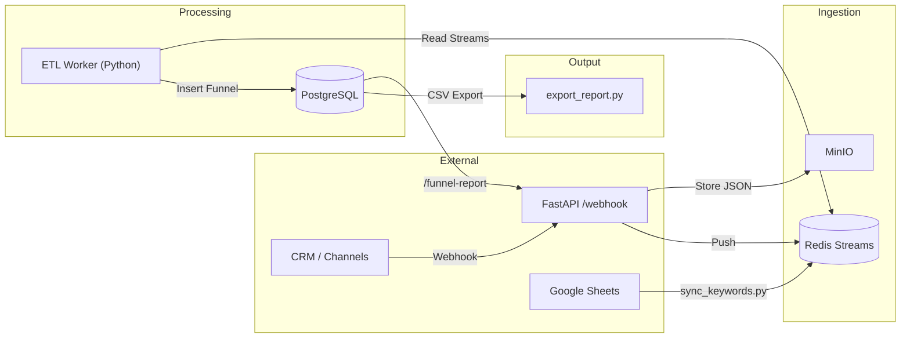

# Funnel Message
Sistem ini dirancang untuk mengelola ratusan ribu pesan harian dari berbagai channel (ads, campaign blast, website, direct, dll.), mengubahnya menjadi data funnel yang dapat dipakai oleh tim growth.

Funnel yang dihasilkan mencakup:

- Leads date
- Channel
- Phone number
- Booking date
- Transaction date
- Transaction value

## Tech Stack

- FastAPI -> REST API entrypoint (webhook, report, sync keywords).

- PostgreSQL -> Data warehouse untuk menyimpan hasil funnel.

- Redis -> Stream processing & cache keywords.

- MinIO (S3 compatible) -> Penyimpanan raw message (JSON).

- Docker Compose -> Orkestrasi semua service (API, worker, db, redis, minio).

- Python (asyncio, asyncpg, redis.asyncio) -> ETL worker untuk membaca pesan dari Redis, parsing, dan simpan ke PostgreSQL.

- GSpread + Google Service Account -> Sinkronisasi dynamic keywords dari Google Sheets.

## Arsitektur & Data Flow



Flow Penjelasan:

1. Webhook menerima pesan baru -> disimpan mentah ke MinIO (JSON) + metadata dimasukkan ke Redis Stream.

2. Keyword Sync Service mengambil keywords dari Google Sheets, push ke Redis (keywords:opening, keywords:booking, keywords:transaction).

3. ETL Worker membaca pesan dari Redis, klasifikasi funnel (lead, booking, transaksi), lalu upsert ke PostgreSQL.

4. Reporting tersedia via API (/funnel-report) atau CSV export ke file.

## How to run

```
docker compose up -d --build \
&& python3 tests/mock_source.py \
&& sleep 3 \
&& python3 tests/export_report.py
```

### Test Webhook

```
python3 tests/mock_source.py
```

### Generate CSV

```
python3 tests/export_report.py
```

## How to stop
```
docker compose down -v
```