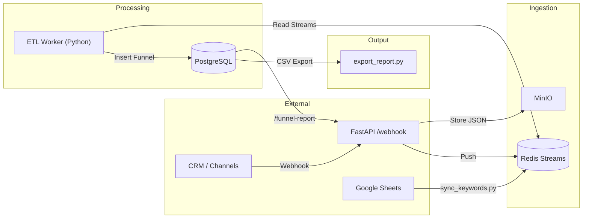

# Funnel Message
Sistem ini dirancang untuk mengelola ratusan ribu pesan harian dari berbagai channel (ads, campaign blast, website, direct, dll.), mengubahnya menjadi data funnel yang dapat dipakai oleh tim growth.

Funnel yang dihasilkan mencakup:

- Leads date
- Channel
- Phone number
- Booking date
- Transaction date
- Transaction value

## Tech Stack

- FastAPI -> REST API entrypoint (webhook, report, sync keywords).

- PostgreSQL -> Data warehouse untuk menyimpan hasil funnel.

- Redis -> Stream processing & cache keywords.

- MinIO (S3 compatible) -> Penyimpanan raw message (JSON).

- Docker Compose -> Orkestrasi semua service (API, worker, db, redis, minio).

- Python (asyncio, asyncpg, redis.asyncio) -> ETL worker untuk membaca pesan dari Redis, parsing, dan simpan ke PostgreSQL.

- GSpread + Google Service Account -> Sinkronisasi dynamic keywords dari Google Sheets.

## Arsitektur & Data Flow



Flow Penjelasan:

1. Webhook menerima pesan baru -> disimpan mentah ke MinIO (JSON) + metadata dimasukkan ke Redis Stream.

2. Keyword Sync Service mengambil keywords dari Google Sheets, push ke Redis (keywords:opening, keywords:booking, keywords:transaction).

3. ETL Worker membaca pesan dari Redis, klasifikasi funnel (lead, booking, transaksi), lalu upsert ke PostgreSQL.

4. Reporting tersedia via API (/funnel-report) atau CSV export ke file.

## How to run

```
docker compose up -d --build \
&& python3 tests/mock_source.py \
&& sleep 3 \
&& python3 tests/export_report.py
```

### Test Webhook

```
python3 tests/mock_source.py
```

### Generate CSV

```
python3 tests/export_report.py
```

## How to stop
```
docker compose down -v
```


## Monitoring dengan Prometheus, Grafana, dan Loki


Sistem ini sudah dilengkapi **custom metrics** untuk memantau alur funnel lewat Redis:

```python
metrics = {
    "redis_messages_total": Counter(
        "redis_messages_total", "Total messages pushed to Redis stream"
    ),
    "redis_messages_ack": Counter(
        "redis_messages_ack", "Total messages acknowledged (ACK) by worker"
    ),
    "redis_messages_pending": Gauge(
        "redis_messages_pending", "Total messages still pending / not ACK"
    )
}
```

### Cara Kerja Metrics
- redis_messages_total -> menghitung jumlah pesan yang masuk ke Redis Stream (traffic harian).

- redis_messages_ack -> menghitung jumlah pesan yang berhasil diproses oleh Worker.

- redis_messages_pending -> jumlah pesan yang belum diproses (indikasi backlog atau bottleneck).


### Grafana

#### Membuka Dashboard

Akses Grafana di browser:

```
http://localhost:3000
```

- Pilih dashboard Sparks Project Monitoring

Panel yang tersedia:

- Message Ingress (redis_messages_total, rate per detik).

- Message Processed (ACK) (redis_messages_ack).

- Pending Messages (redis_messages_pending, gauge).

Cara Membaca Metrics

- Total Messages (Ingress) -> menunjukkan berapa banyak pesan masuk dari semua channel. Jika drop drastis -> kemungkinan ada masalah di API/webhook.

- ACKed Messages -> menunjukkan jumlah pesan yang berhasil diproses worker. Idealnya grafik ini mendekati grafik ingress.

- Pending Messages -> menunjukkan backlog. Jika angka ini terus naik tanpa turun -> bottleneck di worker, mungkin perlu scaling atau ada bug parsing.